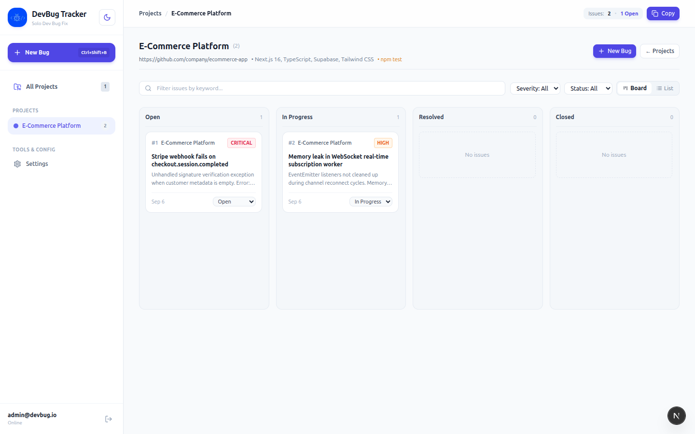
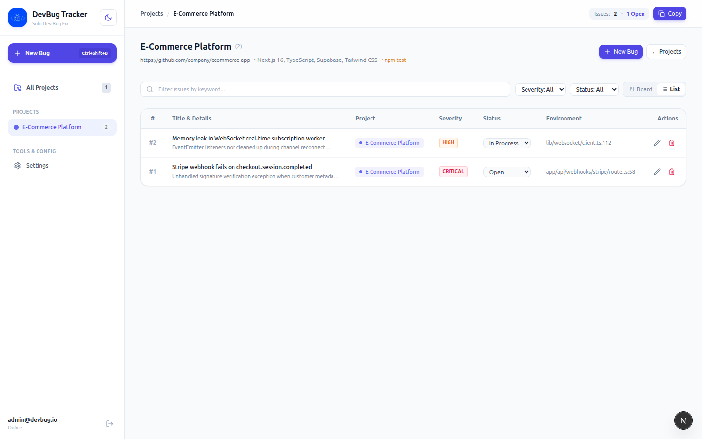
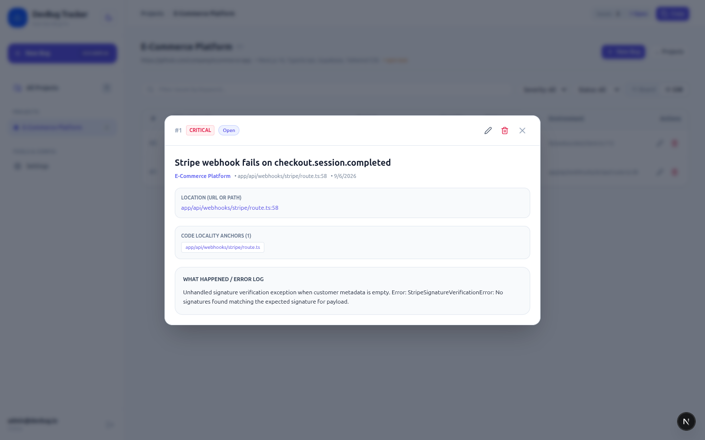
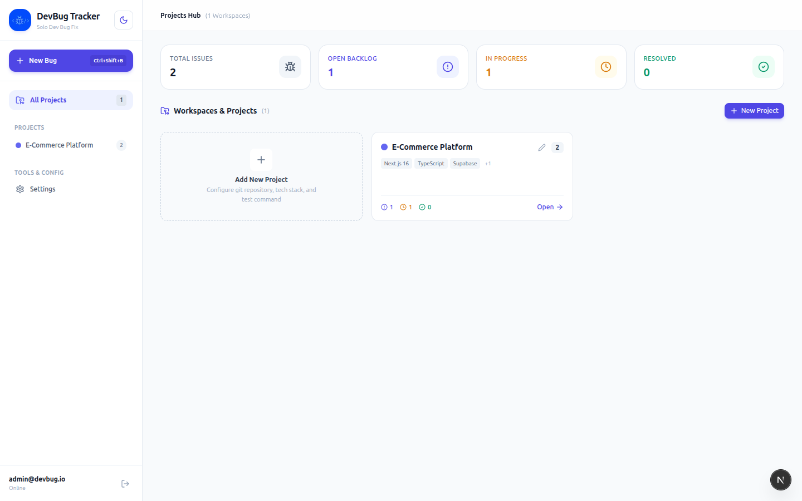
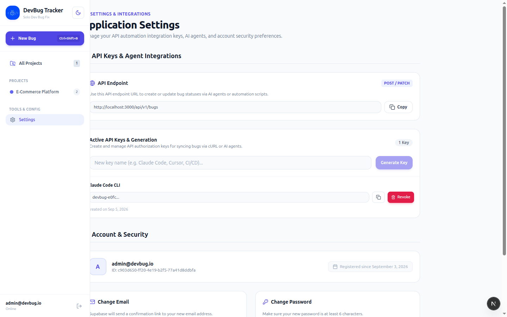

<div align="center">

# 🐞 DevBug Tracker

### *Developer-Centric Bug Tracking & AI Agent Lifecycle Sync Platform*

<p align="center">
  <b>English</b> •
  <a href="README.id.md"><b>Bahasa Indonesia</b></a>
</p>

[](https://nextjs.org/)
[](https://react.dev/)
[](https://www.typescriptlang.org/)
[](https://supabase.com/)
[](https://tailwindcss.com/)

---

### 🌐 Quick Navigation

[📸 Preview](#-preview) • [✨ Key Features](#-key-features) • [🛠️ Tech Stack](#️-tech-stack) • [⚡ Quick Start](#-quick-start) • [🤖 AI Agent & CLI](#-ai-coding-agent-integration--cli) • [📁 Directory Structure](#-directory-structure) • [🤝 Contributing](#-contributing--code-standards)

---

</div>

<br />

## 📸 Preview

<div align="center">
  <h3>📋 Interactive Kanban Board</h3>
  
</div>

<br />

<table width="100%">
  <tr>
    <td width="50%" align="center">
      <b>📊 High-Density List View & Filtering</b>
      <br/><br/>
      
    </td>
    <td width="50%" align="center">
      <b>🔍 Stack Trace & Code Anchors Inspector</b>
      <br/><br/>
      
    </td>
  </tr>
  <tr>
    <td width="50%" align="center">
      <b>📁 Projects & Workspace Hub</b>
      <br/><br/>
      
    </td>
    <td width="50%" align="center">
      <b>🔑 API Keys & Automation Settings</b>
      <br/><br/>
      
    </td>
  </tr>
</table>

---

## ✨ Key Features

- **📋 Dual View Workspace Experience:**
  - **Interactive Kanban Board:** Visual stage tracking (`Open`, `In Progress`, `Resolved`, `Closed`) with instant status transitions.
  - **High-Density Responsive List View:** Filter issues by severity (`Critical`, `High`, `Medium`, `Low`), status, and keywords with 1-click quick status selectors.
- **🤖 Autonomous AI Coding Agent Integration:**
  - **Native CLI (`npx devbug-tracker`):** AI agents (Cursor, Claude Code, Windsurf, Aider) can update bug lifecycles (`start`, `resolve`, `fail`, `list`) straight from their terminal execution loop.
  - **REST API (`/api/v1/bugs`):** Authenticated Bearer / API Key endpoints with CORS support for CI/CD pipelines and external automation.
  - **API Key Management:** Self-service API key generation with SHA-256 secure hashing and revocation controls.
  - **Structured Agent Context (`devbug-tracker.json`):** Export active bug context formatted to the standard schema (`public/schema/agent-context-v1.json`).
  - **Copy AI Prompt:** Generate LLM-ready debugging prompts containing stack traces, error explanations, and code locality anchors.
- **📁 Multi-Project Segregation:** Organize and isolate issues per repository or microservice with customized badges, tech stack definitions, and test commands.
- **🖼️ Clipboard Screenshot Paste (`Ctrl + V`):** Paste bug screenshots directly from your clipboard without saving files to disk, automatically stored in Supabase Storage buckets.
- **🔒 Multi-Tenant Security & OTP Auth:**
  - Self-service account registration with 6-digit email OTP verification via SMTP (`nodemailer` + `input-otp`).
  - Row-Level Security (RLS) ensuring total workspace data isolation across users.
- **🌓 Theming Engine:** Zero-flicker dark/light mode toggle powered by `next-themes` and Tailwind CSS.

---

## 🛠️ Tech Stack

- **Core Framework:** [Next.js 16](https://nextjs.org/) (App Router, Server Components & Server Actions)
- **UI Library & Language:** [React 19](https://react.dev/), [TypeScript 5.7](https://www.typescriptlang.org/)
- **Styling:** [Tailwind CSS 3.4](https://tailwindcss.com/), `lucide-react`, `clsx`, `tailwind-merge`
- **Database & Storage:** [Supabase](https://supabase.com/) (PostgreSQL 15+, Supabase Auth, Storage, Realtime)
- **Data Validation & Parsing:** [Zod 4](https://zod.dev/), `marked`, `dompurify`
- **Auth & Email Delivery:** `@supabase/ssr`, `nodemailer` (OTP registration), `input-otp`
- **Containerization:** Docker Compose (local self-hosted PostgreSQL option)

---

## 📋 Prerequisites

- **Node.js:** Version `22.x` (enforced via `.nvmrc`)
- **Package Manager:** `npm` (or compatible package manager)
- **Database:** Active Supabase Cloud project OR local Docker daemon for self-hosted PostgreSQL

---

## ⚡ Quick Start

### 1. Clone & Install Dependencies

```bash
git clone https://github.com/F41541/devbug-tracker.git
cd devbug-tracker
npm install
```

### 2. Database & Environment Configuration

Choose between the interactive CLI wizard or manual setup:

#### Option A: Interactive Wizard (Recommended)

Run the built-in configuration wizard:

```bash
npm run setup
```

The wizard guides you through selecting your database backend (Supabase Cloud or Docker), populating `.env.local`, and optionally seeding the initial admin account.

#### Option B: Manual Configuration

1. Copy the environment template:
   ```bash
   cp .env.example .env.local
   ```
2. Configure `.env.local`:
   ```env
   # Supabase Credentials
   NEXT_PUBLIC_SUPABASE_URL=https://your-project.supabase.co
   NEXT_PUBLIC_SUPABASE_ANON_KEY=your-anon-key
   SUPABASE_SERVICE_ROLE_KEY=your-service-role-key

   # Base Application URL
   NEXT_PUBLIC_APP_URL=http://localhost:3000

   # SMTP Configuration (Required for Email OTP Registration)
   SMTP_HOST=smtp.gmail.com
   SMTP_PORT=465
   SMTP_SECURE=true
   SMTP_USER=your-email@gmail.com
   SMTP_PASS=your-app-password
   SMTP_FROM="DevBug Tracker <your-email@gmail.com>"
   ```
3. Run the database schema migration:
   Open your Supabase **SQL Editor** and execute the entire [`supabase-schema.sql`](./supabase-schema.sql) file. This initializes tables (`projects`, `bug_items`, `attachments`, `api_keys`), RLS policies, Realtime publications, and the `bug-attachments` storage bucket.

### 3. Seed Default Admin Account (Optional)

Provision the default admin user:

```bash
npm run seed
```

- **Default Email:** `admin@devbug.io` (customizable via `SEED_ADMIN_EMAIL`)
- **Default Password:** `123456` (customizable via `SEED_ADMIN_PASSWORD`)

---

## 💻 Running the Application

```bash
# Run Development Server
npm run dev

# Typecheck & TypeScript Validation
npm run lint

# Production Build
npm run build

# Start Production Server
npm run start
```

Access the application in your browser at `http://localhost:3000`.

---

## 🤖 AI Coding Agent Integration & CLI

DevBug Tracker includes a standalone CLI binary (`devbug-tracker`) allowing autonomous agents to synchronize investigation and fix lifecycles directly:

```bash
# Set bug status to 'in_progress'
npx devbug-tracker start <BUG_UUID> --key=<API_KEY> --url=http://localhost:3000

# Set bug status to 'resolved' with root cause summary
npx devbug-tracker resolve <BUG_UUID> "Fixed input sanitization typo in auth route" --key=<API_KEY>

# Record a failed attempt
npx devbug-tracker fail <BUG_UUID> "Unit test failed on assertions status 401" --key=<API_KEY>

# List open issues for a workspace
npx devbug-tracker list --project=<PROJECT_UUID> --key=<API_KEY>
```

> **Tip:** Set `DEVBUG_API_KEY` and `DEVBUG_URL` in your environment to run commands without repetitive `--key` and `--url` flags.

---

## 📁 Directory Structure

```text
├── app/                  # Next.js App Router (pages, layouts, server actions, REST API)
│   ├── actions.ts        # Primary server actions for project & bug CRUD
│   ├── api/v1/bugs/      # REST API for AI Agent & automation integration
│   ├── auth/             # Authentication actions, session handling, OTP email flow
│   ├── login/            # Login page
│   ├── register/         # OTP verification registration page
│   ├── project/          # Projects Hub & project workspace views
│   └── settings/         # API key management and account security
├── bin/                  # Standalone CLI executable (devbug-tracker.mjs)
├── components/           # UI components, modals, and views
│   ├── bugs/             # Bug cards, modals, detail views, and prompt generator
│   ├── projects/         # Project creation, workspace cards, and manager modals
│   └── ui/               # Base UI elements (Button, Input, Modal, Toast, InputOTP)
├── lib/                  # Utilities, Supabase clients (client, server, admin), mailer, validations
├── public/               # Static assets and AI agent JSON schema definition
├── scripts/              # Setup wizard (setup.mjs) and database seed (seed.mjs)
├── docker-compose.yml    # Local PostgreSQL container configuration
└── supabase-schema.sql   # Complete PostgreSQL schema, RLS policies, and storage setup
```

---

## ⚙️ Environment Variables

| Variable | Required | Description |
| :--- | :---: | :--- |
| `NEXT_PUBLIC_SUPABASE_URL` | Yes | Supabase project URL (Cloud or local endpoint). |
| `NEXT_PUBLIC_SUPABASE_ANON_KEY` | Yes | Public anon key for client-side queries. |
| `SUPABASE_SERVICE_ROLE_KEY` | Yes | Service role key for admin operations, seeding, and OTP signing. |
| `NEXT_PUBLIC_APP_URL` | Optional | Application URL (default: `http://localhost:3000`). |
| `SMTP_HOST` | Conditional | SMTP server host for sending registration OTP codes (e.g. `smtp.gmail.com`). |
| `SMTP_PORT` | Conditional | SMTP port (e.g. `465` or `587`). |
| `SMTP_SECURE` | Conditional | SSL/TLS connection flag (`true` for port 465). |
| `SMTP_USER` | Conditional | SMTP username / email address. |
| `SMTP_PASS` | Conditional | SMTP password or App Password. |
| `SMTP_FROM` | Conditional | Sender identity string for OTP emails. |

---

## 🤝 Contributing & Code Standards

Community contributions and suggestions are welcome!

1. Verify type safety: `npm run lint`
2. Verify production build: `npm run build`
3. Adhere to our [Code of Conduct](CODE_OF_CONDUCT.md) and [Contributing Guidelines](CONTRIBUTING.md).

---

## 📄 License

This project is licensed under the [MIT License](LICENSE) © 2026 M. Faisal Fahri.
